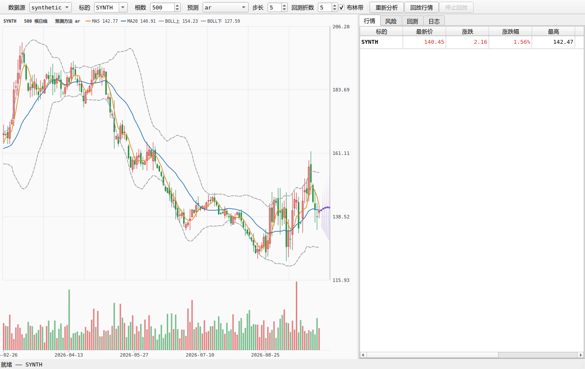
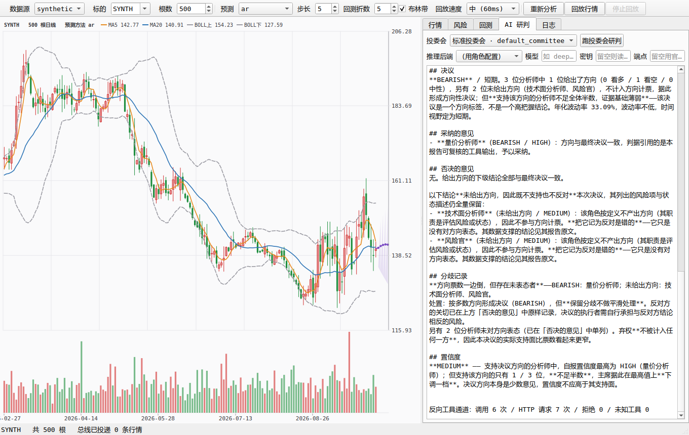

# FinPulse Terminal

C++20/Qt6 桌面金融终端，内置常驻 Python 分析引擎（MIT）。

C++ 侧负责界面与低延迟管道，Python 侧负责统计与建模。桌面壳通过双向管道驱动
一个常驻的分析子进程：进程间使用长度前缀帧协议与请求-响应 RPC，进程内使用
线程安全的发布订阅总线，把行情、指标与预测分发给任意多个消费者。

```
┌────────────────────────── C++ 壳 (Qt6 / CLI) ──────────────────────────┐
│   MainWindow / CliApp                                                 │
│        │ 语义化调用                    ▲ agent.stream.<run_id> 事件    │
│   PyEngine  ── RpcClient  ── FrameCodec  ── Subprocess                │
│        │         (请求-响应关联+超时)  (4字节前缀帧)   (pipe/进程)      │
│        │                                                              │
│   AgentService ──── ToolBridge（localhost HTTP，Python 反向回调 C++）  │
└────────┼───────────────────────────────────────────────┼──────────────┘
         │            stdin / stdout 双向管道             │
┌────────▼────────────────── Python 引擎 ────────────────▼──────────────┐
│   protocol（对偶编解码）→ rpc（方法表+错误翻译）→ service（28 方法）    │
│   │                        11 个基础方法 + 17 个 agent.* 方法          │
│   ├─ datasource 注册表（synthetic / csv / tushare 插件）               │
│   ├─ analysis（指标 / 统计） forecast（AR / 随机游走 / 回测）           │
│   └─ agent（角色配置 → LLM 抽象 → 工具 → 护栏/记忆 → 投委会编排）       │
└───────────────────────────────────────────────────────────────────────┘
```

## 功能

- **跨语言进程桥接**：`[4 字节大端长度][UTF-8 JSON]` 帧协议，增量解帧处理半包、粘包与跨帧切片；长度头异常即判定流损坏，壳重建子进程
- **进程内发布订阅总线**：通配主题（`*` 单层、末尾 `**` 多层）、多订阅者并行消费、锁外派发
- **技术指标与风险统计**：MA / BOLL / RSI / ATR；收益率、CAGR、年化波动、夏普、索提诺、最大回撤、VaR / CVaR、偏度、峰度、自相关
- **预测与回测**：随机游走、AR(p)（手写 OLS + AIC 选阶）、walk-forward 回测、技能分
- **数据源插件**：synthetic（合成）/ csv / tushare（实时 A 股日 K），`@register` 注册表，新增数据源不改引擎代码
- **智能体研判**：4 个角色与 1 个投委会，编排为独立结论 → 交叉质证 → 主席报告
- **可切换推理后端**：内置规则后端（离线、确定性）与 OpenAI 兼容后端（DeepSeek / Moonshot / 通义 / Ollama / 自建网关等）
- **反向工具通道**：Python 在推理过程中回调 C++ 侧终端状态（最新行情 / 总线统计 / 数据质量），仅绑定回环地址
- **数字溯源护栏**：报告中每个数值须可回溯至该角色的工具输出或它收到的提示词原文
- **图形界面**：自绘 K 线、逐根回放、对话式研判页、参数设置对话框
- **零第三方依赖**：C++ 侧仅用 C++20 标准库与平台 API，Python 侧仅用标准库

## 截图

<p align="center">
  
  
</p>

## 依赖

- C++20 编译器（GCC 11+ / Clang 14+ / MSVC 2022）
- CMake 3.20+，Ninja 或 Make
- Python 3.10+（仅标准库，无需 pip 安装）
- Qt 6.4+（可选，未找到时跳过 GUI，CLI 不受影响）

## 构建与运行

```bash
cmake -S . -B build -G Ninja -DCMAKE_BUILD_TYPE=Release
cmake --build build -j"$(nproc)"

# 命令行：6 节报告（引擎 → 行情 → 指标 → 风险 → 预测 → 回测）
./build/finpulse-cli --bars 250 --seed 42
./build/finpulse-cli --source csv --symbol 600519 --bars 500   # 读 data/ 下的 CSV
export TUSHARE_TOKEN=<token>                                    # 实时 A 股日 K
./build/finpulse-cli --source tushare --symbol 000001.SZ --bars 250

# 命令行：智能体投委会研判（第 7 节，事件流 + 投票表 + 主席报告）
./build/finpulse-cli --agent --bars 300          # 三个分析师 → 交叉质证 → 主席
./build/finpulse-cli --agent --list              # 列出角色与投委会
./build/finpulse-cli --agent --role risk_officer --brief
./build/finpulse-cli --agent --no-bridge         # 不启动工具桥，走降级路径

# 接入大模型（未配置时报告"未连接大模型"，不静默回退）
./build/finpulse-cli --agent --provider deepseek --model deepseek-chat --api-key <key>

# 图形界面
./build/src/gui/finpulse-gui
./build/src/gui/finpulse-gui --screenshot /tmp/x.png --ask "茅台现在风险在哪"
# Windows：双击 scripts/run-gui.cmd（内含 WSLg copy mode 预检，见 docs/manual.md 10.1）

# 测试
ctest --test-dir build --output-on-failure
python3 python/tests/run_tests.py
```

### 常用参数

```
finpulse-cli [--source synthetic|csv|tushare] [--symbol SYNTH] [--bars N]
             [--csv 路径] [--seed N] [--method ar|randomwalk]
             [--horizon N] [--folds N] [--min-train N] [--bus-demo] [-v]
finpulse-cli --agent [--role <id>] [--panel <id>] [--rounds N]
             [--provider <name>] [--model <id>] [--base-url <url>]
             [--api-key <key>] [--no-bridge] [--brief] [--list]
```

`-v` 打开引擎与桥接层的调试日志；`--bus-demo` 演示总线上多订阅者并行消费。

`--agent` 复用同一个引擎进程，分析方法与 `agent.*` 方法注册在同一把 RPC 通道上，
研判使用的行情与指标来自同一次装载。该模式额外启动一个仅绑定回环地址的 HTTP
工具桥，供 Python 在推理过程中调用 C++ 侧终端状态，调用次数打印在报告末尾。

## 测试与验证

| 检查项 | 结果 |
|---|---|
| C++ 单元测试 | 157 通过 / 0 失败（`tests/`，自研 80 行测试框架） |
| Python 单元测试 | 547 通过 / 0 失败（`python/tests/`，WSL 与 Windows 双平台） |
| C++ 构建 | 零 error / 零 warning（GCC 13.3.0，`-Wall -Wextra -Wpedantic`） |
| GUI 构建 | 零 error / 零 warning（Qt 6.8.3，含 AUTOMOC） |
| CLI 全链路 | 6 次 RPC 全部成功 |
| CLI 智能体研判 | 投委会 2 轮 + 主席，Python 反向回调 C++ 终端工具 6 次，0 拒绝 |
| GUI 运行 | 引擎握手成功，主窗口、AI 研判页与设置界面渲染正常 |
| 端到端冒烟 | `bash scripts/smoke_test.sh` 7 步全部通过 |

复现：`bash scripts/smoke_test.sh`（构建 → C++ 测试 → Python 测试 → CLI → 研判 →
CSV → GUI，任一步失败即非零退出）。

## 项目结构

```
FinPulseTerminal/
├── src/core/        Json（手写受限解析器）/ Log / Topic（通配主题）/ DataHub（发布订阅总线）
├── src/bridge/      FrameCodec / Subprocess（POSIX+Windows 双实现）/ RpcClient / PyEngine
├── src/model/       Timestamp / Quote / Candle / CandleSeries / Forecast
├── src/data/        ReplaySource（历史 K 线按时间轴重放成实时行情）
├── src/agent/       AgentService（C++ 门面）/ ToolBridge（反向工具通道，只绑回环）
├── src/app/         CliApp（6+1 节报告式 CLI）/ EventText（事件→文案，CLI 与 GUI 共用）
├── src/gui/         MainWindow / QuoteTableModel / CandleChartWidget（自绘 K 线）
│                    ChartInteraction（点击切换的拖动模式）+ AI 研判页
├── python/finpulse_engine/
│   ├── protocol.py  与 FrameCodec.cpp 严格对偶的帧编解码
│   ├── rpc.py       方法表 + 错误翻译（任何异常不杀进程）
│   ├── service.py   11 个基础方法 + 17 个 agent.* 方法
│   ├── stream.py    事件通道（与响应帧共用一把写锁守住帧边界）
│   ├── analysis/    indicators / stats（纯标准库）
│   ├── datasource/  base / registry（@register 插件）/ synthetic / csvfile / tushare
│   ├── forecast/    randomwalk / ar（OLS + AIC 选阶）/ backtest（walk-forward）
│   └── agent/       config（声明式角色/投委会 + 配置体检） llm（rule_based / openai_compat
│                    + override 运行时覆盖：provider/model/base_url/api_key 穿四层）
│                    tools（工具注册表 + HttpToolClient 反向回调） schemas / guardrails
│                    memory（决议记忆） orchestrator（独立 → 交叉质证 → 主席） api（RPC 安装）
│                    configs/*.json（4 角色 + 投委会，改配置不用重编）
├── tests/           C++ 测试（自研框架，157 例）
├── python/tests/    Python 测试（unittest，547 例）
├── tools/           probe.py（手工驱动引擎，含通用 rpc 子命令）/ bench_bridge.cpp（桥接基准）
├── scripts/         smoke_test.sh（一键端到端，7 步）
└── docs/            使用手册 / 架构 / 协议规格 / 设计取舍 / 迭代记录 / 截图
```

## 文档

| 文档 | 内容 |
|---|---|
| [docs/manual.md](docs/manual.md) | 安装、命令行与界面操作、报告解读、智能体详解、配置与排错 |
| [docs/architecture.md](docs/architecture.md) | 进程结构、线程模型、DataHub 并发语义 |
| [docs/bridge-protocol.md](docs/bridge-protocol.md) | 帧格式、RPC 信封与错误码表 |
| [docs/design-decisions.md](docs/design-decisions.md) | 各项"不用现成库"的决定与代价 |
| [docs/iteration-log.md](docs/iteration-log.md) | 开发过程中修复的缺陷记录 |

## License

MIT，见 [LICENSE](LICENSE)。
